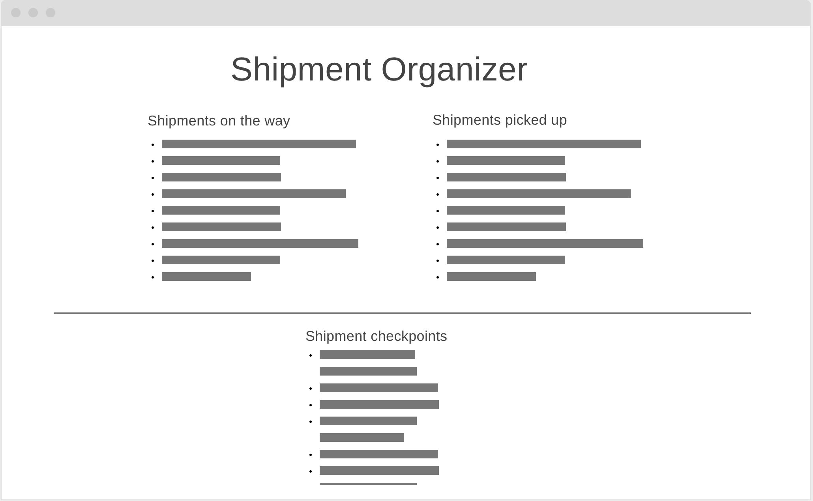

# Shipment-Organizer
A React shipment app that organize shipments into lists 

## User Stories
1. A user can add shipments to track 
2. A user delete shipments that are already recieved 
3. A user can see the timeline of each shipment 
4. A user can see which shipment carrier is responsible for each shipment 

## Wireframes 

## Technologies used 
1. HTML 
2. CSS
3. JS 
4. React 
5. Axios 
6. Postman 
7. PHPStorm 